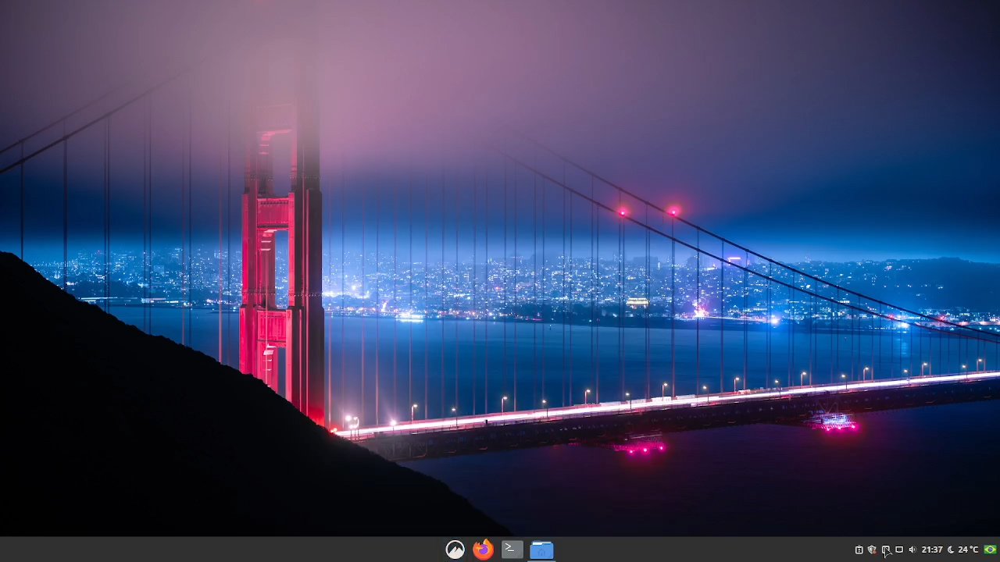

# Linux Mint moderno

Configuração do Linux Mint para um visual moderno e elegante, versão Cinnamon.

Ao final seu tema deve ser parecido com o da imagem abaixo: 

 

  

## Configuração do tema:

1 - Troque para o tema mint-y aqua
- Habilite a edição do painel;
- Mova os aplicativos e o botão do menu iniciar para o centro da barra;
- Em configuração do painel coloque-o em intelligent hide.

2 - Crie uma pasta chamada .icons na sua HOME;

3 - Copie a pasta Papirus-Blue e Tela para essa pasta .icons

4 - Copie a pasta chamada volantes_cursors para dentro da pasta .icons.

5 - Dentro da pasta .themes na sua HOME copie a pasta zorin-blue-gtk.

  

A ídeia aqui é deixar seu linux com um visual bonito e diferenciado, espero que gostem das modificações no visual.

### Você pode ver como configurei esse setup no Youtube:

<iframe width="560" height="315" src="https://www.youtube.com/embed/qVBam9d29vk" title="YouTube video player" frameborder="0" allow="accelerometer; autoplay; clipboard-write; encrypted-media; gyroscope; picture-in-picture" allowfullscreen></iframe>

